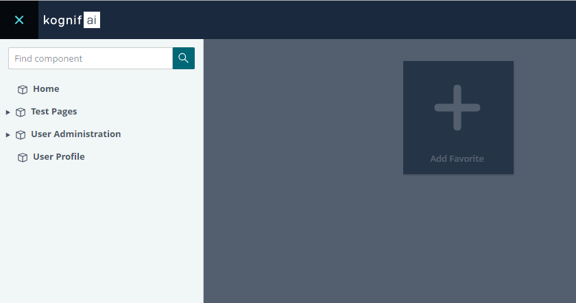

# Getting Started with Kognifai 

If you are developing your first application using Kognifai, then you need Poseidon Next framework to get started with.
To build your applicaiton, you need:

NodeJs 8 or greater

After installing NodeJs, the process of applicaiton development starts with:

- Installing Poseidon Dev Host
- Getting the Host URL
- Installing and Hosting Applications 
- Creating your own Poseidon Application 
- Using Kognifai’s Design System 
- Adding Services and Modules 

Let's go through these steps in detail:

# Prerequisites 
- [NodeJs 8 or greater](https://nodejs.org/)
- .Net Framework (Optional- Depends upon user's requriement and the output generated by npm packages)

# Poseidon Dev Host
Poseidon Dev host is a service that allows you to load and host your applicaitons.

## Installation
In order to start developing Poseidon Applications, you should get **Poseidon-dev-host**. You can install it from NPM globally:

```powershell
npm install @kognifai/poseidon-dev-host@latest -g
```

## Hosting
After you've globally installed **Poseidon-dev-host** you can start it with the following command:

```powershell
poseidon-dev-host
```
The console shows a message that it is now listening on http://localhost:8080. Opening the browser on this URL currently does not load anything as you need to get the Poseidon applications. Stop the dev-host now and proceed with the next step.

# Installing existing applications

Start by creating an empty directory in your local work directory:
```powershell
mkdir C:\kognifai\applications
cd C:\kognifai\applications
```
You can use NPM to install the applications:
```powershell
npm install @kognifai/poseidon-home@latest
npm install @kognifai/poseidon-user-profile@latest
npm install @kognifai/poseidon-user-administration@latest
npm install @kognifai/poseidon-test-pages@latest
```
You can now tell **Poseidon-dev-host** to load and host these applications:
(**Note-** Remember to stop the **Poseidon-dev-host** if it is currently running. You can stop it by pressing Ctrl+C in the console)
```powershell
poseidon-dev-host --applications "C:\kognifai\applications"
```
The ```--applications``` parameter specifies the directory in which **poseidon-dev-host** will look for applications (including subfolder **/node_modules\@kognifai**).

 An application is considered a directory which contains content files (html pages, scripts, styles, assets, etc) together with application manifest file (**app.manifest.json**).
When the command is executed, the host should output a message listing all the applications' manifests it found, similar to:
```
Hosting applications from C:\kognifai\applications
Loading application manifests
	Home
	Test Pages
	User Administration
	User Profile
```
Open a browser at http://localhost:8080 in order to see the Poseidon platform. The host comes with a developer friendly security solution. Type in any username and password to log in. Then the platform is loaded, you can see the left hand side navigation menu with applications:



# Creating a new Poseidon Application
You can create new Posiedon applications by using Yeoman generator, a scaffolding tool that helps you build web applicaitons.  

## Installing Yeoman
If you have not yet installed Yeoman, you can do so by executing this command:
```powershell
npm install -g yo
```

## Installing the Yeoman generator
You can install the **kognifai-poseidon** Yeoman generator from NPM:
```powershell
npm install -g @kognifai/generator-poseidon@latest
```

## Using the generator
You should use the generator in the kognifai applications folder:
```powershell
cd C:\kognifai\applications
yo @kognifai/poseidon:application
```
Follow the instructions of the generator to fill in the required information. 
The name of the new app should be same as the name of the folder (e.g. my-first-app). After the generator completes, you will have a working simple application. Start it:
```powershell
cd C:\kognifai\applications\my-first-app
npm start
```
Restart **poseidon-dev-host** and reload the platform in your browser. You should be able to see and open the newly created application from the side navigation menu.
- You can use VS Code (or your favourite IDE/code editor) to edit the source code:
```powershell
code.
```
Any code changes you make on application pages, scripts, and styles will be automatically reflected in the browser (live reload).
- You can use NPM scripts to start, build, lint, and test:
```powershell
npm start
npm run build
npm run lint
npm run test
```
# Using the Kognifai Design System

Kognifai Design System is a collection of design patterns, components, and guidelines for creating unified and coherent UI in the Kognifai ecosystem.

It contains a set of easy-to-use HTML/CSS components. It does not include JavaScript since we aim to be versatile and technology agnostic. Use it together with any JS framework.

To read the documentation head over to [https://designsystem.kognif.ai/](https://designsystem.kognif.ai/)

# Next Step

Next step is to explore the [Services](Services.md) and tools, they are a part of Poseidon Next.


Once your app is ready, you can do more with Kognifai using IoT and Galore components. 
Explore these topics to know all those possibilities:

-	[Kognifai IoT](https://github.com/kognifai/IoT)
-	[Connector SDK](https://github.com/kognifai/IoT/blob/master/SDK%20Documentation/readme.md)
-	[Edge connectors and endpoints overview](https://github.com/kognifai/IoT/blob/master/IoT%20Documentation/Overview%20%20Connectors%20and%20Endpoints%20.md)
-	[Galore](https://github.com/kognifai/Galore)
-	[Galore Asset Model](https://github.com/kognifai/Galore/blob/master/Galore-Documentation/readme.md)
-	[Streams](https://github.com/kognifai/Galore/blob/master/Galore-Documentation/streams.md)
-	[TQL Syntax](https://github.com/kognifai/Galore/blob/master/Galore-Documentation/TQL%20Syntax.md)
-	[Node Selector](https://github.com/kognifai/Galore/blob/master/Galore-Documentation/Node%20Selector.md)
-	[Pipeline Operations](https://github.com/kognifai/Galore/blob/master/Galore-Documentation/Pipeline%20Operations.md)
-	[Case Study](https://github.com/kognifai/Galore/blob/master/Galore-Documentation/casestudy.md)


